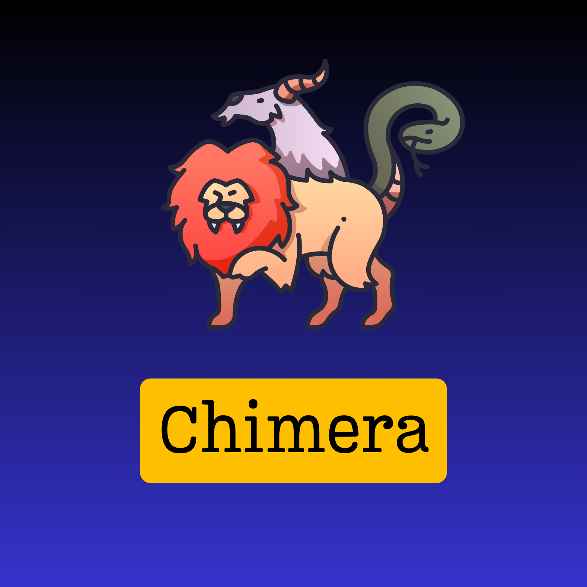

# Chimera
chimera is a program that injects a code (e.g malicious code) into a Linux ELF program by overwriting the PT_NOTE section of the target ELF file thereby enabling the hacker run malicious code. This malicious code could be a backdoor!



## Features

- Overwrites **PT_NOTE** to insert a new section
- Maintains ELF structure integrity
- Supports **x86_64 Linux ELF binaries**
- Injects payloads dynamically

## How It Works
1. **Parses the ELF file**
2. **Finds and modifies the PT_NOTE segment**
3. **Injects a new section with custom payload**
4. **Ensures the ELF remains executable**

## Installation
### 🔧 Dependencies
- Linux OS
- `gcc` (or `clang`)
- `libelf`

### 📦 Build
```sh
git clone https://github.com/hotwrist/chimera.git
cd chimera
gcc chimera.c -o chimera -lelf
```

## Usage
### Generating the payload
```sh
nasm -f bin -o payload.bin tcp_socket_client.asm
```

### 💎 Injecting a Payload
```sh
./chimera <target.elf> <payload.bin> ".inject_section" <injected_session_address> <entry point>
```

## Example
```sh
./chimera date payload.bin ".chimera" 0x600000 -1
./date
```

## NOTE
This program might not work for ELF binaries that are dynamically linked. This is because the return address becomes dynamic when in execution.
To overcome this, you can make use of a technique known as HIJACKING GOT ENTRIES. Click on the Youtube link below to watch how to implement this.

## 🛡️ Legal Disclaimer
This tool is intended for educational and research purposes **only**. **Do not** use it on unauthorized systems.

## 🌟 License
This project is licensed under the **MIT License**. See `LICENSE` for details.


